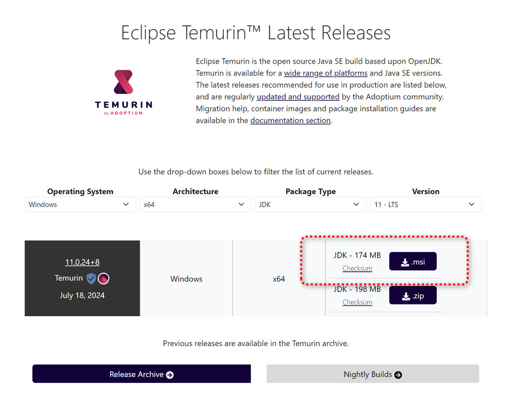
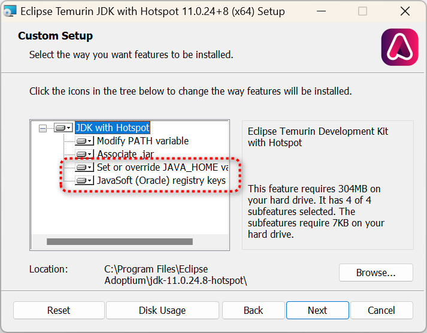

# a-good-groovy-lang
learn groovy step-by-step เป็น repository สำหรับฝึกเรียนภาษา Groovy โดยยึดเอาข้อกำหนดคร่าวๆ ดังนี้ 

1. Groovy language v4.x
2. Java v11.x (JDK ไม่ใช่ JRE)

## macOS, Linux, Windows 10/11 + WSL2

โดยทั้งคู่แนะนำให้ติดตั้งจาก **sdkman** ซึ่งสำหรับ macOS, Linux จะง่ายมาก ส่วนบน Windows จะใช้ผ่าน **WSL2** (Windows SubSystem for Linux) ซึ่งต้องติดตั้งให้เรียบร้อยก่อน โดยทั้งนี้จะเป็น Ubuntu Linux v22.x โดยอัตโนมัติ

- [SDKMan](https://sdkman.io/install)

ขั้นตอนการติดตั้ง Java 11, Groovy [ดูได้จาก video นี้](https://youtu.be/T6iBlG9h_hA)

## หากไม่ต้องการใช้ WSL2 

็สามารถติดตั้ง Groovy, JDK 11 โดยดาวน์โหลดโดยตรงจากที่นี่ได้

- [Eclipse Temurin JDK 11](https://adoptium.net/temurin/releases/?version=11&os=any&arch=any&package=jdk)
- [Groovy Language](https://groovy.jfrog.io/ui/native/dist-release-local/groovy-windows-installer/groovy-4.0.22/)

### Note
ตัว Eclipse ควรดาวน์โหลด และติดตั้งโดยการเลือกข้อย่อยตามรูปนี้ 

## IDE

เราจะใช้ IntelliJ IDEA Ultimate (หรือ Community หากยังไม่เขียนเว็บ) ซึ่งดาวน์โหลดได้จากที่ [Jetbrains Website](https://www.jetbrains.com/idea/)
